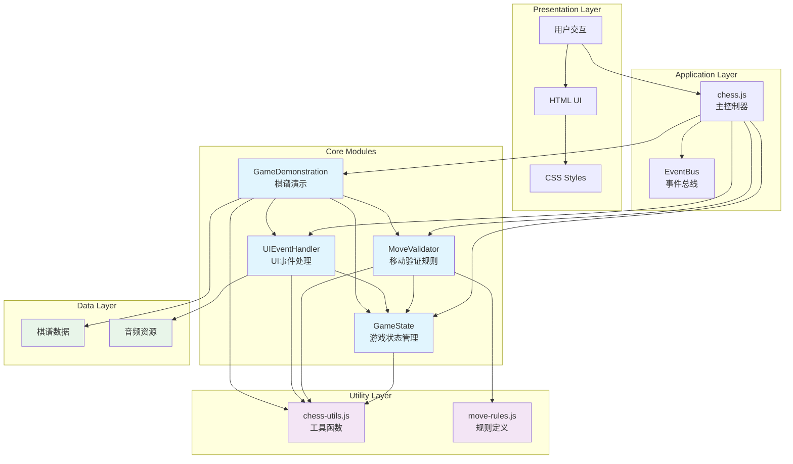
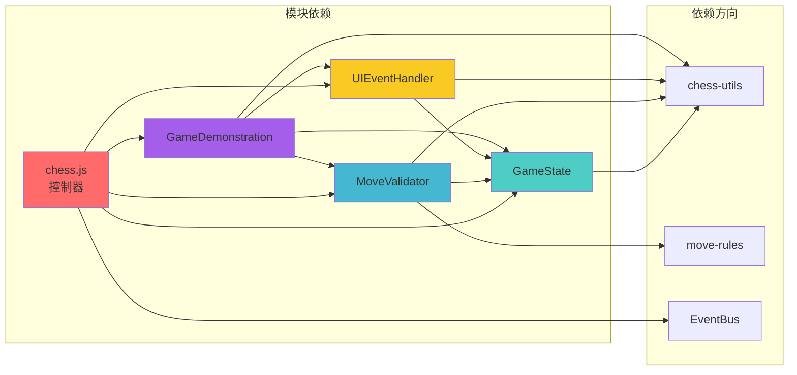
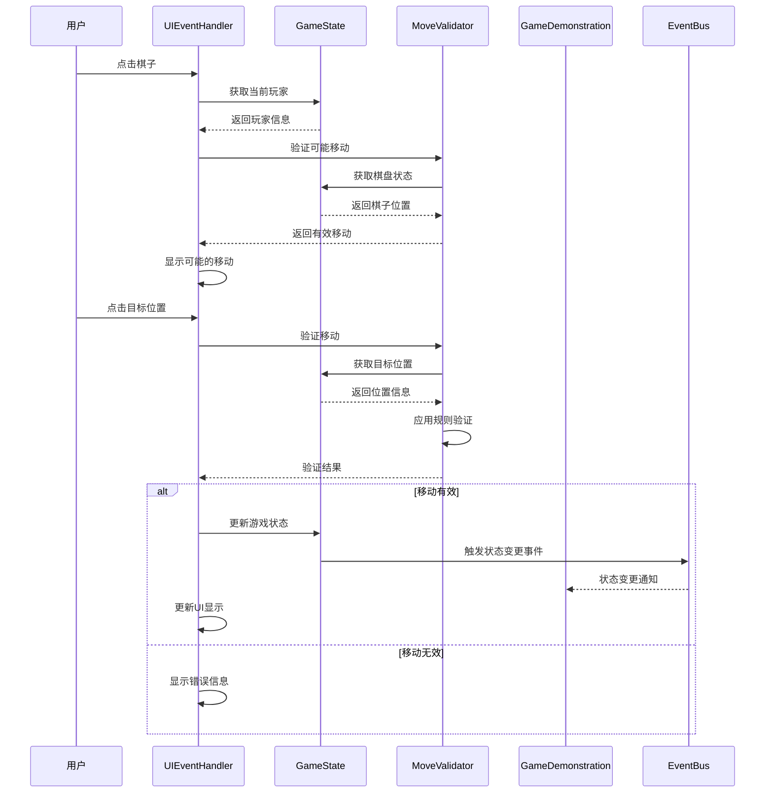
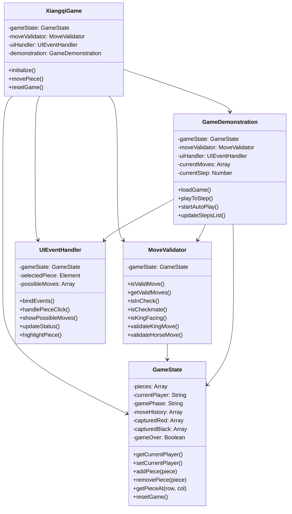
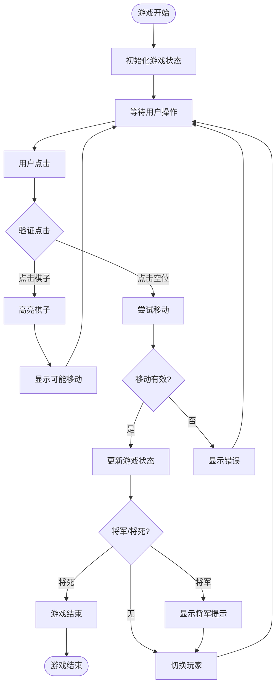
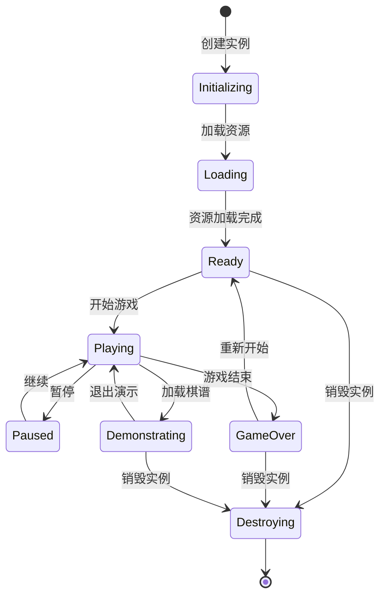

# 中国象棋模块化架构图

## 系统整体架构

```mermaid
graph TB
    subgraph "Presentation Layer"
        HTML[HTML UI]
        CSS[CSS Styles]
        USER[用户交互]
    end

    subgraph "Application Layer"
        MAIN[chess.js<br/>主控制器]
        EVENT[EventBus<br/>事件总线]
    end

    subgraph "Core Modules"
        STATE[GameState<br/>游戏状态管理]
        VALID[MoveValidator<br/>移动验证规则]
        UI[UIEventHandler<br/>UI事件处理]
        DEMO[GameDemonstration<br/>棋谱演示]
    end

    subgraph "Utility Layer"
        UTILS[chess-utils.js<br/>工具函数]
        RULES[move-rules.js<br/>规则定义]
    end

    subgraph "Data Layer"
        JSON[棋谱数据]
        AUDIO[音频资源]
    end

    USER --> HTML
    HTML --> CSS
    USER --> MAIN

    MAIN --> EVENT
    MAIN --> STATE
    MAIN --> VALID
    MAIN --> UI
    MAIN --> DEMO

    VALID --> STATE
    UI --> STATE
    DEMO --> STATE
    DEMO --> VALID
    DEMO --> UI

    STATE --> UTILS
    VALID --> UTILS
    VALID --> RULES
    UI --> UTILS
    DEMO --> UTILS

    DEMO --> JSON
    UI --> AUDIO

    classDef core fill:#e1f5fe
    classDef util fill:#f3e5f5
    classDef data fill:#e8f5e9

    class STATE,VALID,UI,DEMO core
    class UTILS,RULES util
    class JSON,AUDIO data
```

## 模块依赖关系图

```mermaid
graph LR
    subgraph "模块依赖"
        GS[GameState]
        MV[MoveValidator]
        UE[UIEventHandler]
        GD[GameDemonstration]
        CC[chess.js<br/>控制器]
    end

    subgraph "依赖方向"
        CU[chess-utils]
        MR[move-rules]
        EB[EventBus]
    end

    CC --> GS
    CC --> MV
    CC --> UE
    CC --> GD
    CC --> EB

    MV --> GS
    UE --> GS
    GD --> GS
    GD --> MV
    GD --> UE

    GS --> CU
    MV --> CU
    MV --> MR
    UE --> CU
    GD --> CU

    style CC fill:#ff6b6b
    style GS fill:#4ecdc4
    style MV fill:#45b7d1
    style UE fill:#f9ca24
    style GD fill:#a55eea
```

## 数据流图

```mermaid
sequenceDiagram
    participant U as 用户
    participant UI as UIEventHandler
    participant S as GameState
    participant V as MoveValidator
    participant D as GameDemonstration
    participant E as EventBus

    U->>UI: 点击棋子
    UI->>S: 获取当前玩家
    S-->>UI: 返回玩家信息
    UI->>V: 验证可能移动
    V->>S: 获取棋盘状态
    S-->>V: 返回棋子位置
    V-->>UI: 返回有效移动
    UI->>UI: 显示可能的移动

    U->>UI: 点击目标位置
    UI->>V: 验证移动
    V->>S: 获取目标位置
    S-->>V: 返回位置信息
    V->>V: 应用规则验证
    V-->>UI: 验证结果

    alt 移动有效
        UI->>S: 更新游戏状态
        S->>E: 触发状态变更事件
        E-->>D: 状态变更通知
        UI->>UI: 更新UI显示
    else 移动无效
        UI->>UI: 显示错误信息
    end
```

## 类关系图

```mermaid
classDiagram
    class GameState {
        -pieces: Array
        -currentPlayer: String
        -gamePhase: String
        -moveHistory: Array
        -capturedRed: Array
        -capturedBlack: Array
        -gameOver: Boolean
        +getCurrentPlayer()
        +setCurrentPlayer()
        +addPiece(piece)
        +removePiece(piece)
        +getPieceAt(row, col)
        +resetGame()
    }

    class MoveValidator {
        -gameState: GameState
        +isValidMove()
        +getValidMoves()
        +isInCheck()
        +isCheckmate()
        +isKingFacing()
        +validateKingMove()
        +validateHorseMove()
    }

    class UIEventHandler {
        -gameState: GameState
        -selectedPiece: Element
        -possibleMoves: Array
        +bindEvents()
        +handlePieceClick()
        +showPossibleMoves()
        +updateStatus()
        +highlightPiece()
    }

    class GameDemonstration {
        -gameState: GameState
        -moveValidator: MoveValidator
        -uiHandler: UIEventHandler
        -currentMoves: Array
        -currentStep: Number
        +loadGame()
        +playToStep()
        +startAutoPlay()
        +updateStepsList()
    }

    class XiangqiGame {
        -gameState: GameState
        -moveValidator: MoveValidator
        -uiHandler: UIEventHandler
        -demonstration: GameDemonstration
        +initialize()
        +movePiece()
        +resetGame()
    }

    XiangqiGame --> GameState
    XiangqiGame --> MoveValidator
    XiangqiGame --> UIEventHandler
    XiangqiGame --> GameDemonstration
    MoveValidator --> GameState
    GameDemonstration --> GameState
    GameDemonstration --> MoveValidator
    GameDemonstration --> UIEventHandler
```

## 事件流图

```mermaid
flowchart TD
    START([游戏开始]) --> INIT[初始化游戏状态]
    INIT --> WAIT[等待用户操作]

    WAIT --> CLICK[用户点击]
    CLICK --> CHECK{验证点击}

    CHECK -->|点击棋子| HIGHLIGHT[高亮棋子]
    HIGHLIGHT --> SHOW[显示可能移动]
    SHOW --> WAIT

    CHECK -->|点击空位| MOVE[尝试移动]
    MOVE --> VALID{移动有效?}

    VALID -->|是| UPDATE[更新游戏状态]
    VALID -->|否| ERROR[显示错误]

    UPDATE --> CHECKMATE{将军/将死?}
    ERROR --> WAIT

    CHECKMATE -->|将死| GAMEOVER[游戏结束]
    CHECKMATE -->|将军| ALERT[显示将军提示]
    CHECKMATE -->|无| SWITCH[切换玩家]

    ALERT --> SWITCH
    SWITCH --> WAIT
    GAMEOVER --> END([游戏结束])
```

## 组件生命周期图

```mermaid
stateDiagram-v2
    [*] --> Initializing: 创建实例
    Initializing --> Loading: 加载资源
    Loading --> Ready: 资源加载完成

    Ready --> Playing: 开始游戏
    Playing --> Paused: 暂停
    Paused --> Playing: 继续

    Playing --> Demonstrating: 加载棋谱
    Demonstrating --> Playing: 退出演示

    Playing --> GameOver: 游戏结束
    GameOver --> Ready: 重新开始

    Ready --> Destroying: 销毁实例
    GameOver --> Destroying: 销毁实例
    Demonstrating --> Destroying: 销毁实例

    Destroying --> [*]
```