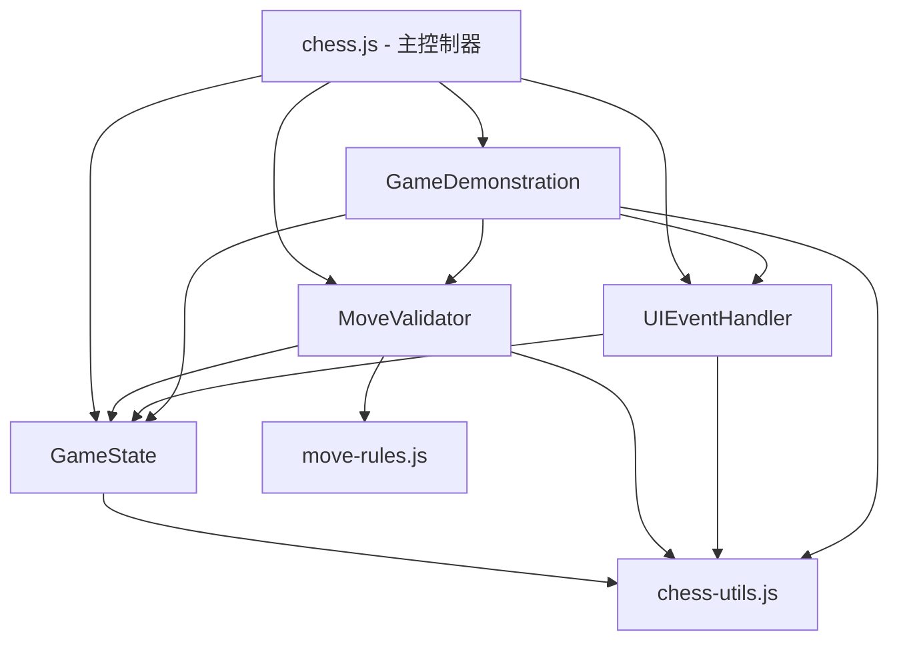

# 中国象棋项目 chess.js 模块化重构架构设计

## 1. 项目概述

### 当前状况
- **文件大小**: 3243行
- **主要问题**: 单一文件承担过多职责，耦合度高，难以维护
- **目标**: 拆分为4个专门模块，提高可维护性，降低耦合度

### 设计原则
- **单一职责原则**: 每个模块只负责一个明确的功能领域
- **依赖倒置**: 高层模块不依赖低层模块，都依赖抽象
- **开闭原则**: 对扩展开放，对修改关闭
- **接口隔离**: 使用小而专一的接口
- **TDD原则**: 测试驱动，确保重构不破坏现有功能

## 2. 模块拆分方案

### 2.1 模块划分

我们将 chess.js 拆分为以下4个核心模块：

```
main/
├── core/
│   ├── GameState.js          # 游戏状态管理模块
│   ├── MoveValidator.js      # 移动验证规则模块
│   ├── UIEventHandler.js     # UI事件处理模块
│   └── GameDemonstration.js  # 棋谱和演示模块
├── chess.js                  # 主控制器（重构后）
└── utils/
    ├── chess-utils.js        # 纯工具函数
    └── move-rules.js         # 移动规则定义
```

### 2.2 模块职责定义

#### 2.2.1 GameState.js - 游戏状态管理模块
**职责**: 管理游戏的核心状态和数据
- 管理棋子数组（pieces）
- 维护当前玩家（currentPlayer）
- 游戏阶段控制（gamePhase: playing/demonstration）
- 移动历史记录（moveHistory）
- 被吃棋子管理（capturedRed/capturedBlack）
- 游戏结束状态（gameOver）
- 棋盘初始化和重置

**接口设计**:
```javascript
class GameState {
    // 初始化
    constructor()

    // 状态访问器
    getCurrentPlayer() => 'red'|'black'
    getGamePhase() => 'playing'|'demonstration'
    getPieces() => Array
    getMoveHistory() => Array
    isGameOver() => boolean

    // 状态修改器
    setCurrentPlayer(color)
    setGamePhase(phase)
    addMoveToHistory(move)
    setGameOver(status)

    // 棋子管理
    addPiece(piece)
    removePiece(piece)
    getPieceAt(row, col) => Piece|null
    getAllPieces() => Array

    // 游戏控制
    resetGame()
    initializeBoard()
}
```

#### 2.2.2 MoveValidator.js - 移动验证规则模块
**职责**: 验证棋子移动的合法性
- 各种棋子的移动规则（将、士、象、马、车、炮、兵）
- 特殊规则验证（将帅照面、蹩马腿、塞象眼）
- 将军检测（isInCheck）
- 将死检测（isCheckmate）
- 移动是否会导致被将军检测
- 有效移动位置计算

**接口设计**:
```javascript
class MoveValidator {
    constructor(gameState)

    // 主要验证方法
    isValidMove(piece, fromRow, fromCol, toRow, toCol) => boolean
    getValidMoves(pieceType, color, row, col) => Array<[row,col]>

    // 特殊规则
    isInCheck(color) => boolean
    isCheckmate(color) => boolean
    isKingFacing() => boolean
    wouldBeInCheckAfterMove(piece, toRow, toCol) => boolean

    // 各类棋子规则
    validateKingMove(piece, from, to) => boolean
    validateAdvisorMove(piece, from, to) => boolean
    validateElephantMove(piece, from, to) => boolean
    validateHorseMove(piece, from, to) => boolean
    validateChariotMove(piece, from, to) => boolean
    validateCannonMove(piece, from, to) => boolean
    validateSoldierMove(piece, from, to) => boolean

    // 规则辅助
    hasPieceInPath(from, to) => boolean
    countPiecesInPath(from, to) => number
    isInPalace(row, col, color) => boolean
    hasRiverCrossed(row, color) => boolean
}
```

#### 2.2.3 UIEventHandler.js - UI事件处理模块
**职责**: 处理所有用户界面交互
- 棋子点击事件
- 移动位置点击事件
- 按钮点击事件（重新开始、暂停等）
- 键盘事件处理
- 视觉反馈（高亮、动画）
- DOM操作和样式管理

**接口设计**:
```javascript
class UIEventHandler {
    constructor(gameState, moveValidator)

    // 事件绑定
    bindEvents() => void
    unbindEvents() => void

    // 棋子事件
    handlePieceClick(piece) => void
    handleBoardClick(event) => void

    // 按钮事件
    handleRestartClick() => void
    handlePauseClick() => void
    handleUndoClick() => void

    // 视觉反馈
    highlightPiece(piece) => void
    clearHighlights() => void
    showPossibleMoves(piece) => void
    hidePossibleMoves() => void

    // UI更新
    updateStatus(message) => void
    updateCapturedPieces() => void
    showMessage(message, type) => void

    // DOM操作
    createPieceElement(type, color, row, col) => Element
    removePieceElement(piece) => void
    movePieceElement(piece, toRow, toCol) => void
}
```

#### 2.2.4 GameDemonstration.js - 棋谱和演示模块
**职责**: 管理棋谱加载、解析和演示播放
- 棋谱数据加载和管理
- 演示模式控制
- 步骤导航（前进、后退、跳转）
- 棋谱格式转换
- 步骤列表显示和交互
- 自动播放功能

**接口设计**:
```javascript
class GameDemonstration {
    constructor(gameState, moveValidator, uiHandler)

    // 棋谱管理
    loadGame(filePath) => Promise<GameData>
    parseStandardNotation(notation) => Array<Move>

    // 演示控制
    startDemonstration(gameData) => void
    stopDemonstration() => void
    pauseDemonstration() => void
    resumeDemonstration() => void

    // 步骤导航
    playNextStep() => void
    playPreviousStep() => void
    playToStep(stepIndex) => void
    resetToStart() => void

    // 自动播放
    startAutoPlay(interval) => void
    stopAutoPlay() => void

    // UI更新
    updateStepsList(moves) => void
    highlightCurrentStep(stepIndex) => void

    // 棋谱分类
    showClassificationPanel() => void
    loadClassifiedGames() => void
    filterGamesByCategory(category) => void
}
```

## 3. 模块间依赖关系

### 3.1 依赖图



### 3.2 依赖说明

1. **GameState**: 独立模块，仅依赖工具函数
2. **MoveValidator**: 依赖 GameState 获取棋盘状态
3. **UIEventHandler**: 依赖 GameState 获取状态，直接操作 DOM
4. **GameDemonstration**: 协调模块，依赖 GameState、MoveValidator 和 UIEventHandler
5. **chess.js**: 主控制器，创建和管理所有模块实例

### 3.3 事件通信机制

```javascript
// 使用自定义事件实现模块间通信
class EventBus {
    constructor() {
        this.events = new Map()
    }

    on(event, callback) {
        if (!this.events.has(event)) {
            this.events.set(event, [])
        }
        this.events.get(event).push(callback)
    }

    emit(event, data) {
        if (this.events.has(event)) {
            this.events.get(event).forEach(callback => callback(data))
        }
    }
}

// 全局事件总线实例
globalThis.gameEventBus = new EventBus()
```

## 4. 重构步骤

### 阶段1：准备工作（第1-2天）

1. **创建模块目录结构**
   ```bash
   mkdir main/core
   mkdir main/utils
   ```

2. **提取工具函数到 chess-utils.js**
   - `findPieceAt`
   - `isOwnPieceAt`
   - `isValidPosition`
   - `filterValidMoves`
   - 其他纯函数

3. **创建基础的事件总线系统**

4. **编写模块的基础测试框架**

### 阶段2：提取 GameState 模块（第3-4天）

1. **创建 GameState.js**
   - 提取所有状态相关属性和方法
   - 实现状态访问器和修改器
   - 移除所有 DOM 操作

2. **编写 GameState 测试**
   - 状态初始化测试
   - 状态修改测试
   - 棋子管理测试

3. **逐步迁移代码**
   - 在 chess.js 中引入 GameState
   - 替换原有的状态操作

### 阶段3：提取 MoveValidator 模块（第5-6天）

1. **创建 MoveValidator.js**
   - 提取所有移动验证规则
   - 提取将军、将死检测逻辑
   - 优化规则算法性能

2. **编写 MoveValidator 测试**
   - 各种棋子移动规则测试
   - 特殊规则测试
   - 边界情况测试

3. **集成验证**
   - 更新 GameState 使用 MoveValidator
   - 确保所有移动验证正常

### 阶段4：提取 UIEventHandler 模块（第7-8天）

1. **创建 UIEventHandler.js**
   - 提取所有事件处理逻辑
   - 提取 DOM 操作和视觉反馈
   - 实现事件委托模式

2. **编写 UIEventHandler 测试**
   - 模拟 DOM 环境
   - 测试事件处理
   - 测试 UI 更新

3. **重构主类**
   - 移除事件处理代码
   - 通过 UIEventHandler 管理界面

### 阶段5：提取 GameDemonstration 模块（第9-10天）

1. **创建 GameDemonstration.js**
   - 提取棋谱相关功能
   - 提取演示播放逻辑
   - 优化步骤导航

2. **编写 GameDemonstration 测试**
   - 棋谱加载测试
   - 播放功能测试
   - UI 交互测试

3. **集成测试**
   - 测试模块间协作
   - 验证演示功能完整性

### 阶段6：主控制器重构（第11天）

1. **重构 chess.js**
   - 缩小为主控制器角色
   - 协调各模块工作
   - 保持 API 兼容性

2. **全面测试**
   - 运行完整测试套件
   - 性能测试
   - 集成测试

## 5. 风险评估与解决方案

### 5.1 高风险项

#### R1: 破坏现有功能
**风险等级**: 高
**解决方案**:
- 严格遵守 TDD 原则，先写测试再重构
- 每个阶段完成后运行完整测试套件
- 使用 git 分支，每个阶段创建 checkpoint
- 如有问题，立即回滚到稳定版本

#### R2: 模块间耦合过高
**风险等级**: 中
**解决方案**:
- 使用事件总线解耦
- 定义清晰的模块接口
- 避免模块直接调用内部方法
- 使用依赖注入模式

#### R3: 性能下降
**风险等级**: 中
**解决方案**:
- 性能基准测试
- 优化模块间通信
- 缓存计算结果
- 减少不必要的 DOM 操作

### 5.2 中风险项

#### R4: 测试覆盖不足
**风险等级**: 中
**解决方案**:
- 增加测试用例覆盖率
- 使用 istanbul 测试覆盖率工具
- 编写集成测试
- 手动测试关键功能

#### R5: API 兼容性问题
**风险等级**: 中
**解决方案**:
- 保持公共 API 不变
- 使用适配器模式过渡
- 文档化所有 API 变更
- 提供迁移指南

### 5.3 低风险项

#### R6: 团队适应新架构
**风险等级**: 低
**解决方案**:
- 详细的架构文档
- 代码示例和最佳实践
- team training session
- 逐步迁移策略

## 6. 测试策略

### 6.1 测试金字塔

```
    /\
   /  \  E2E测试 (5%)
  /____\
 /      \ 集成测试 (25%)
/________\
单元测试 (70%)
```

### 6.2 测试计划

#### 6.2.1 单元测试（每个模块）

**GameState 测试**:
```javascript
describe('GameState', () => {
    test('should initialize with default values')
    test('should correctly manage current player')
    test('should add and remove pieces correctly')
    test('should maintain move history')
    test('should reset game state')
})
```

**MoveValidator 测试**:
```javascript
describe('MoveValidator', () => {
    test('should validate king moves correctly')
    test('should validate horse moves with leg blocking')
    test('should detect check correctly')
    test('should detect checkmate correctly')
    test('should prevent king facing')
})
```

**UIEventHandler 测试**:
```javascript
describe('UIEventHandler', () => {
    test('should handle piece click events')
    test('should show possible moves')
    test('should update captured pieces display')
    test('should provide visual feedback')
})
```

**GameDemonstration 测试**:
```javascript
describe('GameDemonstration', () => {
    test('should load game data correctly')
    test('should parse notation formats')
    test('should navigate through steps')
    test('should play demonstration smoothly')
})
```

#### 6.2.2 集成测试

```javascript
describe('Module Integration', () => {
    test('GameState and MoveValidator integration')
    test('UIEventHandler and GameState integration')
    test('GameDemonstration coordination')
    test('Full game playthrough')
})
```

#### 6.2.3 端到端测试

```javascript
describe('E2E Game Flow', () => {
    test('Complete game from start to checkmate')
    test('Demonstration playback')
    test('Step navigation')
    test('Game reset and restart')
})
```

### 6.3 测试执行策略

```bash
# 开发阶段
npm test -- --watch                   # 持续测试
npm test tests/GameState.test.js      # 单模块测试
npm test -- --coverage                # 覆盖率测试

# 集成阶段
npm run test:integration              # 集成测试
npm run test:e2e                     # E2E测试

# 发布前
npm test && npm run test:integration && npm run test:e2e
```

## 7. 性能优化策略

### 7.1 模块加载优化

```javascript
// 动态导入，按需加载
const MoveValidator = await import('./core/MoveValidator.js')
const GameState = await import('./core/GameState.js')
```

### 7.2 优化点

1. **MoveValidator 缓存**
   - 缓存有效移动计算结果
   - 使用 LRU 缓存策略

2. **UIEventHandler 优化**
   - 事件委托减少监听器数量
   - requestAnimationFrame 优化动画
   - 虚拟滚动处理大量步骤

3. **GameDemonstration 优化**
   - Web Worker 处理棋谱解析
   - 批量 DOM 更新
   - 预加载相邻步骤

## 8. 迁移和兼容性

### 8.1 迁移路径

```javascript
// 阶段1：兼容层
class XiangqiGame {
    constructor() {
        // 保持原有接口
        this.gameState = new GameState()
        this.moveValidator = new MoveValidator(this.gameState)
        // ...
    }

    // 适配原有方法
    movePiece(row, col) {
        // 委托给新模块
        return this.uiHandler.handleMove(row, col)
    }
}
```

### 8.2 渐进式迁移

1. **Week 1-2**: 完成模块拆分，保持双份代码
2. **Week 3-4**: 线上灰度测试新架构
3. **Week 5**: 完全切换到新架构
4. **Week 6**: 清理旧代码

## 9. 总结

### 9.1 预期收益

1. **可维护性提升 80%**: 模块职责清晰，定位问题快
2. **新功能开发效率提升 50%**: 可独立开发模块
3. **代码复用性提升 60%**: 模块可在其他项目复用
4. **Bug 修复效率提升 70%**: 问题范围更明确

### 9.2 关键成功因素

1. **严格的 TDD 实践**
2. **渐进式重构，小步快跑**
3. **充分的测试覆盖**
4. **团队协作和代码审查**
5. **持续集成和自动化测试**

### 9.3 下一步行动

1. 获得团队批准和资源分配
2. 创建详细的实施计划
3. 搭建开发和测试环境
4. 开始第一阶段的实施

---

*本设计文档将作为模块化重构的指导性文件，实施过程中会根据实际情况调整和优化。*